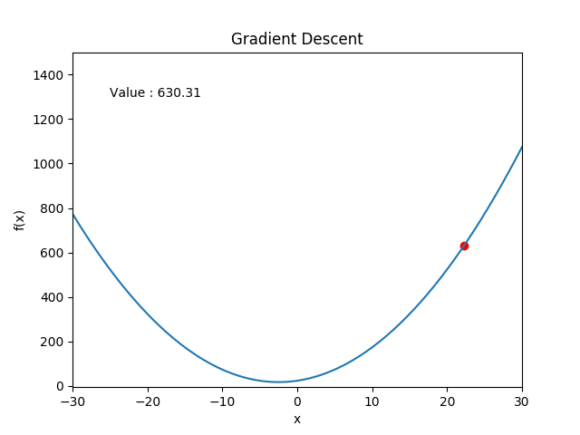
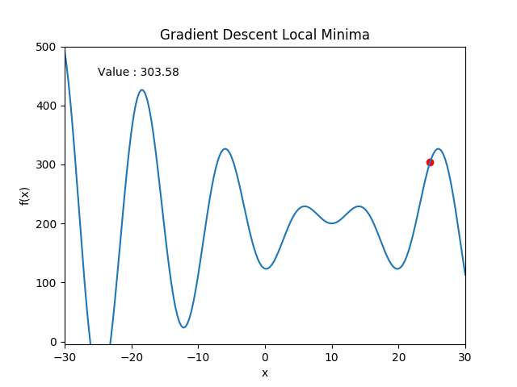
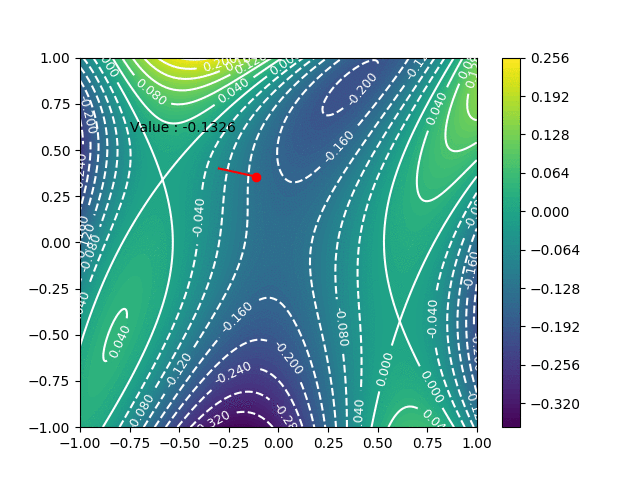

## Gradient Descent Example with Animations
This project presents some animations demonstrating [gradient descent algorithm](http://en.wikipedia.org/wiki/Gradient_descent) for different scenarios.

### Execution

Required packages are numpy and matplotlib. Written in python 3.

Example: `python gradient_descent_1d.py`

### Examples

#### 1 - Finding Minimum Value of a Parabola (gradient_descent_1d.py)

#### 2 - Gradient Descent Converges to a Local Minimum (gradient_descent_local_minima.py)

#### 3 - Gradient Descent on 2D Function (gradient_descent_2d.py)

Function is taken from https://en.wikipedia.org/wiki/Gradient_descent#Examples 

